# 🇭🇺 1. 부다페스트 (9/3 ~ 9/6, 3박)

<table>
  <tr>
    <td width="50%" valign="top">
      <h3>🏨 파리시 우드버르 호텔</h3>
      
<b>Párisi Udvar Hotel Budapest</b>

      
✨ <b>특징:</b> 부다페스트 중심가인 페스트 지구에 위치하며, 호텔 자체 아케이드가 예술품 수준. 야경과 온천에 집중하기 좋은 일정.

    </td>
    <td width="50%" valign="top">
      <a href="https://www.google.com/maps/search/?api=1&query=Párisi+Udvar+Hotel+Budapest" target="_blank">
        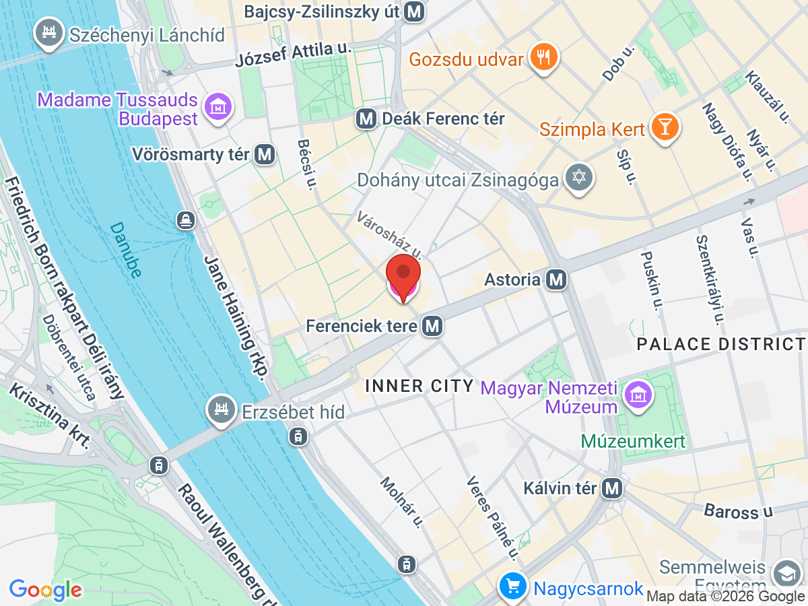
      </a>
    </td>
  </tr>
</table>

## 🗓️ 일정 계획

### 📍 9/3 (목) 입국 및 야경
* **18:05 ~ 19:30**: 부다페스트 공항(BUD T2B) 도착, 수하물 수취 및 호텔 이동. (약 40~50분 소요)
  * 🚌 **100E 공항 익스프레스 버스 이용 안내**:
    * **타는 곳**: 제2터미널(T2A와 T2B 사이) 입국장 앞 100E 버스 정류장
    * **티켓 구매**: 정류장 앞 보라색 BKK 발권기 또는 'BudapestGO' 앱에서 탑승권(Airport shuttle bus single ticket) 구매 (2200 HUF)
    * **경로**: 공항 출발 ➡️ **Kálvin tér(칼빈 광장)** 또는 **Astoria** 하차 (호텔까지 도보 5분 거리)
    * 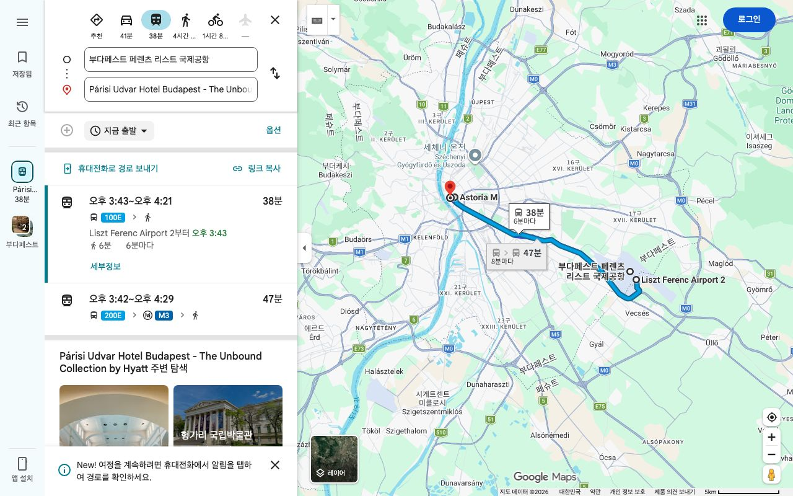
      

<b>다른 맵</b>
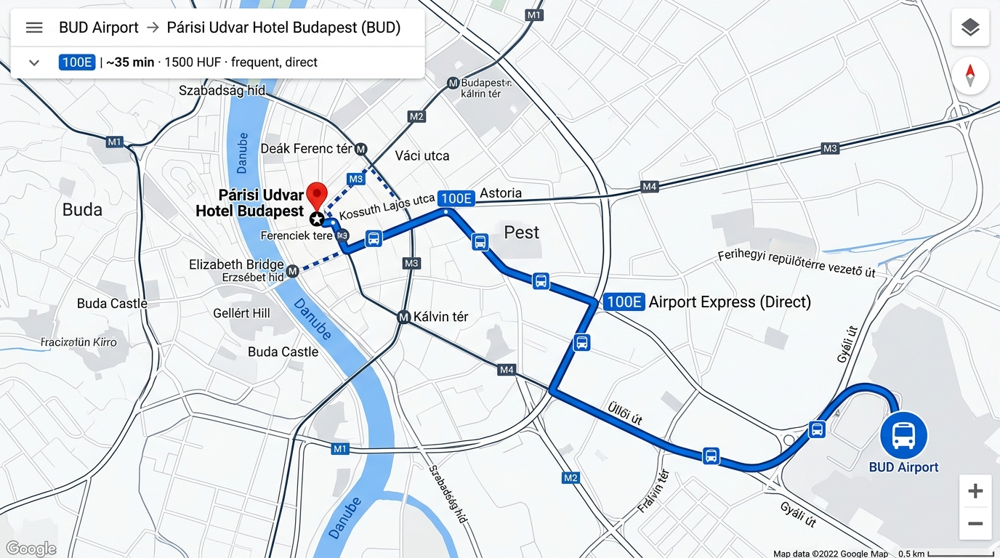

* **19:30 ~ 20:30**: 호텔 체크인 및 늦은 저녁 식사. (호텔 근처 바치 거리(Váci utca) 번화가에서 간단하게 식사)
* **20:30 ~ 21:30**: **세체니 다리** 도보 횡단. (호텔에서 다리까지 도보 15분). 다리를 건너며 도나우 강과 부다 성의 완벽한 야경 감상. 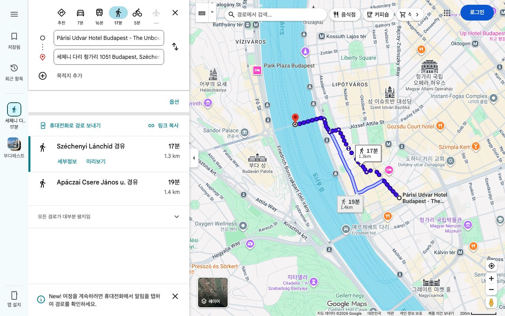 

<b>다른 맵</b>
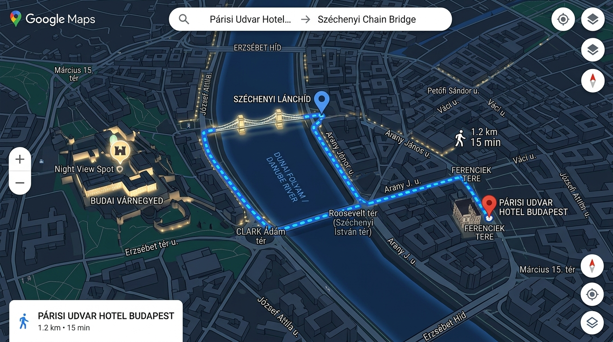
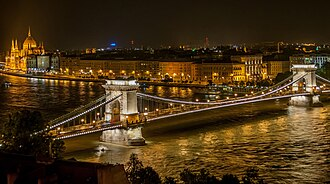
* 💡 **Tip**: 비행 탑승으로 피곤할 수 있으니 첫날 야경 일정은 컨디션에 따라 가볍게 둘러보는 것을 추천합니다. 호텔 1층 '파리시 파사쥬(Párisi Passage)' 카페의 화려한 건축미도 체크인 시 놓치지 마세요.

### 📍 9/4 (금) 부다 지구 집중 투어
* **07:00 ~ 09:00**: 기상 및 호텔 조식 후 외출 준비.
* **09:00 ~ 12:00**: 부다 지구 언덕으로 이동하여 **어부의 요새**와 **마차시 성당** 관람. (오전 9시쯤 도착해야 관광객이 적어 탁 트인 전망에서 인생 사진을 남길 수 있습니다. 관람 약 2시간 소요)
  * 🚌 **이동 방법 (호텔 ➡️ 어부의 요새)**:
    * 호텔에서 도보 3분 거리의 'Ferenciek tere M' 정류장에서 **16번 버스** 탑승 ➡️ 언덕을 올라가 'Szentháromság tér(삼위일체 광장)' 하차 (약 15분 소요).
    * 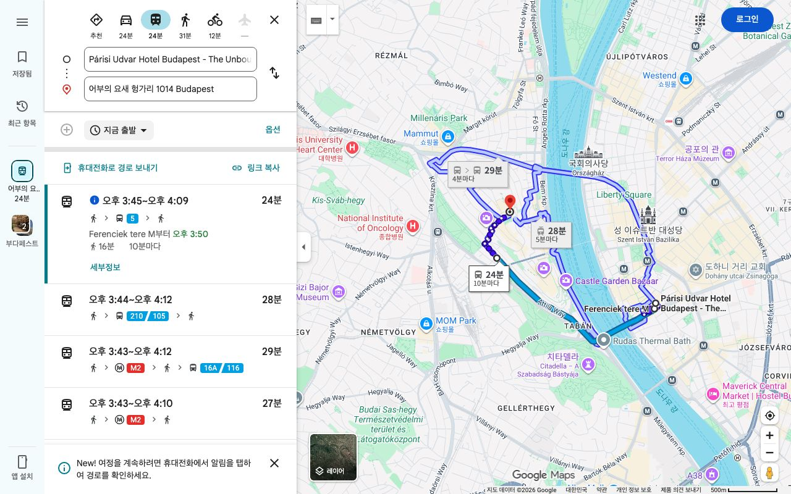
      

<b>다른 맵</b>
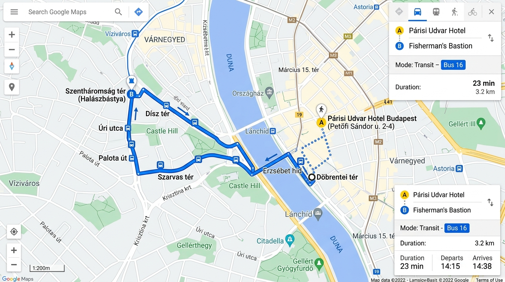

  * 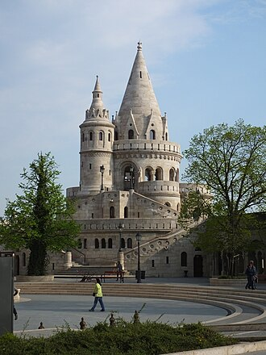
* **12:00 ~ 14:00**: 부다 성 주변에서 점심 식사 및 카페 휴식.
* **14:00 ~ 17:00**: **부다 성(왕궁)** 외부 산책 및 국립 미술관 관람. 왕궁 언덕에서 내려다보는 페스트 지구의 파노라마 뷰 감상.
* **17:00 ~ 20:00**: 푸니쿨라를 타고 내려와 바차니 광장(Batthyány tér)으로 이동. 도나우 강 건너편에서 **국회의사당**에 불이 켜지는 압도적인 장관 감상 후 저녁 식사. 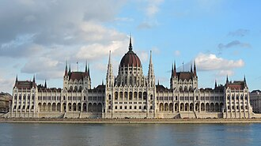
* 💡 **Tip**: 국회의사당 야경 사진은 바차니 광장 쪽 강변 벤치에 앉아서 찍는 것이 정석입니다. 강바람이 찰 수 있으니 가벼운 겉옷을 챙기세요.

### 📍 9/5 (토) 온천과 페스트 지구
* **07:00 ~ 09:00**: 기상 및 조식. 수영복 챙겨서 외출.
* **09:00 ~ 13:00**: **세체니 온천** 방문. 고풍스러운 노란색 궁전 양식의 야외 온천에서 여독 풀기. (수영복 및 슬리퍼 필수 지참, 약 3시간 소요)
  * 🚇 **이동 방법 (호텔 ➡️ 세체니 온천)**:
    * 호텔 근처 'Ferenciek tere' 역에서 M3(파란색) 탑승 ➡️ 'Deák Ferenc tér' 역에서 환승 ➡️ **M1(노란색, 세계에서 2번째로 오래된 지하철)** 탑승 ➡️ 'Széchenyi fürdő(세체니 퓌르되)' 역 하차 (약 20분 소요).
    * 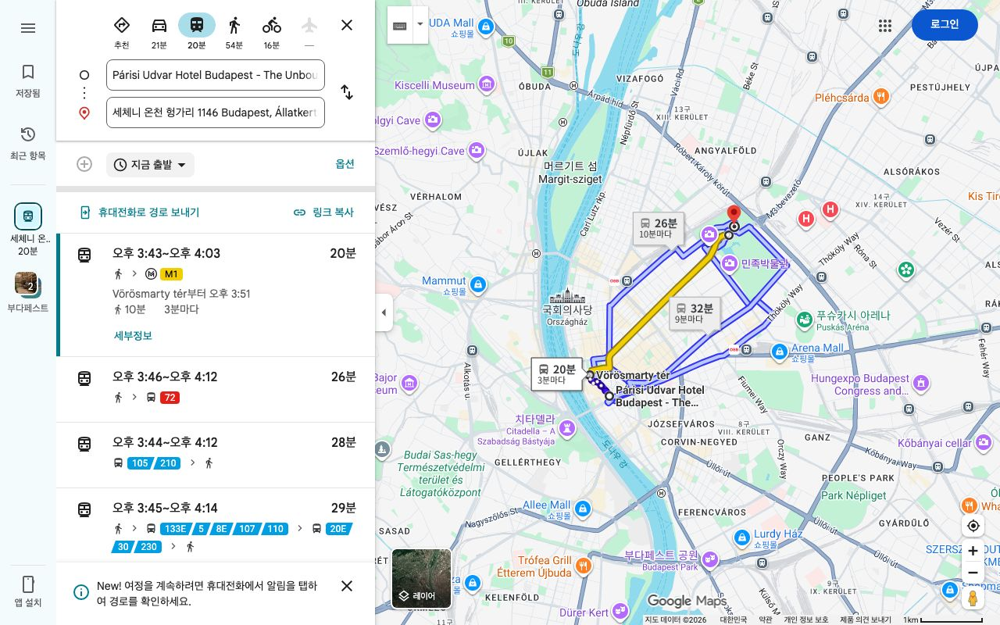
      

<b>다른 맵</b>
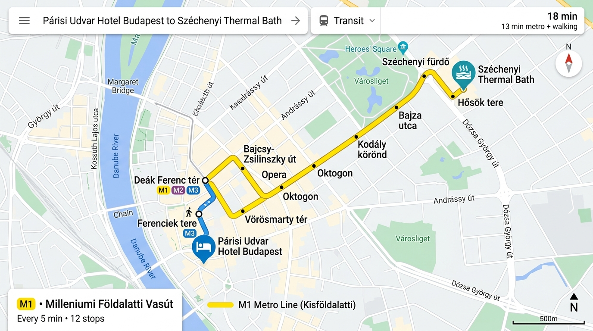

  * 
* **13:00 ~ 15:00**: 온천 근처 시민 공원 산책 후 점심 식사 (예: 군델 레스토랑 또는 멘자).
* **15:00 ~ 18:00**: **성 이슈트반 대성당** 관람 (전망대 등탑 추천). 이후 명품 숍과 카페가 즐비한 안드라시 거리(Andrássy út) 도보 산책.
* **18:00 ~ 22:00**: 저녁 식사 후 부다페스트 특유의 문화인 '루인 바' **Szimpla Kert** 방문. 폐공장을 힙하게 개조한 몽환적인 분위기에서 가볍게 맥주나 칵테일 한 잔.
* 💡 **Tip**: 온천 갈 때는 호텔에서 챙겨간 타월을 가져가면 대여 줄을 서지 않아도 되어 편리합니다.

## 🍽️ 추천 음식 & 식당

* **굴라시 (Gulyás)**: 한국인의 입맛에 딱 맞는 육개장 스타일의 헝가리 전통 수프.
* **랑고쉬 (Lángos)**: 튀긴 납작빵 위에 사워크림과 치즈를 듬뿍 얹어 먹는 길거리 간식.
* **추천 식당 & 카페**:
  * **[멘자 (Menza Restaurant)](https://www.google.com/maps/search/?api=1&query=Menza+Restaurant+Budapest)**: 굴라시와 오리 가슴살 스테이크가 유명한 한국인 필수 코스 식당. (예약 권장)
  * **[키슈카쿠크 (Kiskakukk Étterem)](https://www.google.com/maps/search/?api=1&query=Kiskakukk+Étterem+Budapest)**: 1913년에 오픈한 클래식한 헝가리 식당. 거위 간(푸아그라) 요리와 굴라시가 일품.
  * **[까마귀 식당 (VakVarjú Restaurant)](https://www.google.com/maps/search/?api=1&query=VakVarjú+Restaurant+Budapest)**: 현지인과 관광객 모두에게 인기 있는 가성비 좋고 분위기 좋은 레스토랑.
  * **[뉴욕 카페 (New York Cafe)](https://www.google.com/maps/search/?api=1&query=New+York+Cafe+Budapest)**: 세계에서 가장 아름다운 카페. 화려한 금빛 장식 속에서 디저트 즐기기.
  * **[젤라르토 로사 (Gelarto Rosa)](https://www.google.com/maps/search/?api=1&query=Gelarto+Rosa+Budapest)**: 성 이슈트반 대성당 앞, 아이스크림을 장미꽃 모양으로 예쁘게 빚어주는 젤라또 맛집.

## 🛍️ 필수 쇼핑 리스트

* **토카이 와인 (Tokaji Aszú)**: 세계 3대 귀부 와인 중 하나. 숫자가 높을수록 달콤하며 보통 5~6 puttonyos를 많이 구매함.
* **이노레우마 크림 (Inno Rheuma)**: 일명 '악마의 발톱 크림'. 관절염과 근육통에 효과가 좋아 부모님 선물로 인기 최고.
* **제라니움 크림 / 파프리카 가루**: 헝가리 특산품. 파프리카 가루는 굴라시의 핵심 재료로 요리를 좋아하는 분들께 추천.

---
[⬅️ 메인으로 돌아가기](./README.md)
