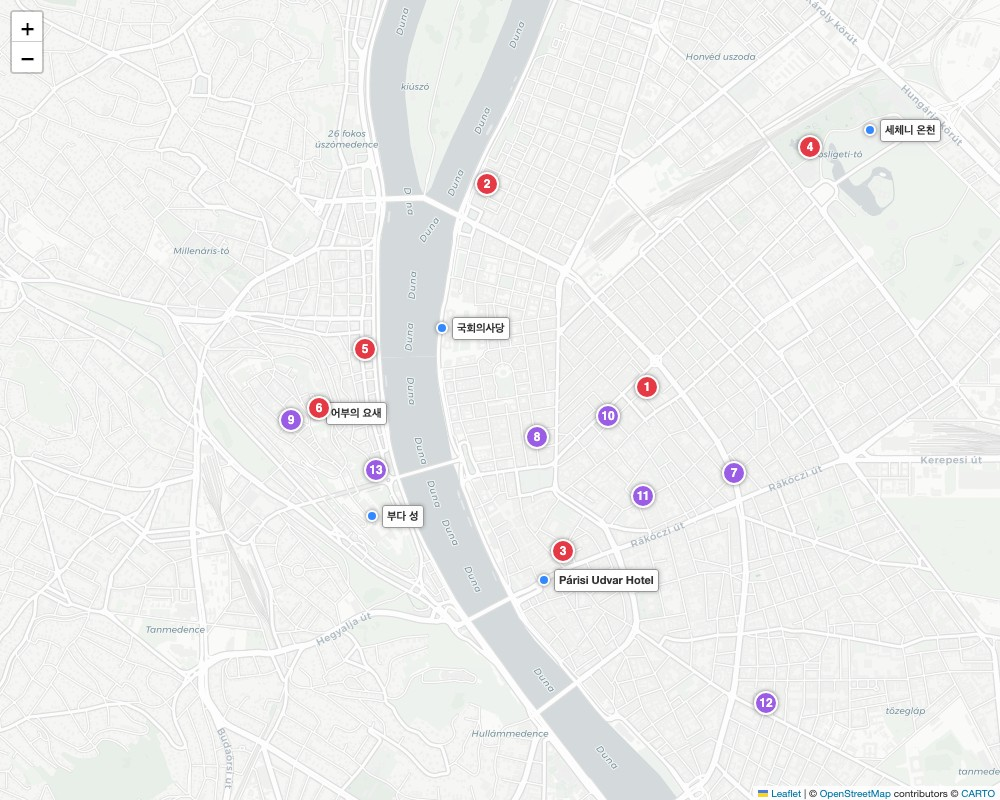

# 🇭🇺 부다페스트 - 미식, 주류 & 쇼핑 가이드

부다페스트는 동유럽 특유의 향신료(파프리카 가루)를 사용한 매콤하고 친숙한 요리부터, 독특한 와인과 언더그라운드 펍 문화까지 미식가들을 설레게 하는 도시입니다. 

---

## 🗺️ 한눈에 보는 미식 & 관광 지도

여행 동선과 맞물려 방문하기 좋은 핵심 관광지(파란색 이름표), 추천 식당(빨간색 번호), 주류 특화 공간(보라색 번호)입니다. 지도 속 번호는 아래 설명의 번호와 일치합니다.

---

## 🍽️ 헝가리 필수 전통 음식

* **굴라시 (Gulyás)**: 소고기, 양파, 감자, 당근에 헝가리산 파프리카 가루를 듬뿍 넣어 끓여낸 헝가리 대표 수프.
* **망갈리차 (Mangalica)**: 헝가리의 국보급 돼지로, '돼지고기계의 고베규'로 불립니다. 
* **할라슬레 (Halászlé)**: 다뉴브 강에서 잡은 민물고기에 파프리카 가루를 넣어 끓인 매콤한 생선 스튜.
* **랑고쉬 (Lángos)**: 튀긴 넓적한 반죽 위에 마늘즙, 사워크림, 치즈를 산더미처럼 얹어 먹는 국민 길거리 간식.
* **퀴르퇴슈칼라치 (Kürtőskalács)**: 일명 '굴뚝빵'. 숯불에 구워 시나몬 설탕이 잔뜩 묻어 있습니다.

---

## 🥩 추천 레스토랑 & 디저트 카페

모든 식당 이름의 링크를 클릭하시면 구글 맵(Google Maps)으로 이동합니다.

### 1. 현지인과 관광객 모두가 사랑하는 로컬 식당
* **[[1] 멘자 (Menza Restaurant)](https://www.google.com/maps/search/?api=1&query=Menza+Restaurant+Budapest)** (안드라시 거리 근처)
  * **특징**: 70년대 레트로 인테리어. 헝가리 전통 요리를 현대적으로 풀어내어 한국인들의 필수 코스로 꼽힙니다.
  * **추천 메뉴**: 진하고 깔끔한 굴라시 수프, 부드러운 오리 가슴살 스테이크.
* **[[2] 키슈카쿠크 (Kiskakukk Étterem)](https://www.google.com/maps/search/?api=1&query=Kiskakukk+Étterem+Budapest)** (마가릿 다리 인근)
  * **특징**: 1913년에 문을 연 유서 깊은 식당. 고전적이고 클래식한 분위기.
  * **추천 메뉴**: 사과를 곁들인 구운 푸아그라(거위 간), 망갈리차 스테이크.
* **[[3] 벨바로시 디스노토로스 (Belvárosi Disznótoros)](https://www.google.com/maps/search/?api=1&query=Belvárosi+Disznótoros+Budapest)** (파리시 우드버르 호텔 도보 3분)
  * **특징**: 푸줏간(정육점) 콘셉트의 패스트푸드식 로컬 맛집. 쇼케이스에서 고기를 고르면 즉석에서 구워줍니다.
  * **추천 메뉴**: 구운 소시지, 오리 다리 구이, 돼지머리 고기.

### 2. 분위기와 뷰가 압도적인 레스토랑
* **[[4] 군델 레스토랑 (Gundel Cafe Patisserie Restaurant)](https://www.google.com/maps/search/?api=1&query=Gundel+Restaurant+Budapest)** (세체니 온천 바로 옆)
  * **특징**: 헝가리 미식의 상징이자 엘리자베스 여왕 등이 방문한 부다페스트 최고급 파인 다이닝 레스토랑입니다. 
  * **추천 메뉴**: 군델 팔라친타 (헝가리식 크레페).
* **[[5] 안젤리카 레스토랑 (Angelika Étterem)](https://www.google.com/maps/search/?api=1&query=Angelika+Étterem+Budapest)** (부다 지구)
  * **특징**: 국회의사당이 정면으로 보이는 뷰 맛집. 일몰 후 테라스 다이닝에 완벽합니다.
* **[[6] 할라쉬바슈탸 레스토랑 (Halászbástya Étterem)](https://www.google.com/maps/search/?api=1&query=Halászbástya+Restaurant+Budapest)** (어부의 요새 내)
  * **특징**: 어부의 요새 내부. 헝가리 최고의 파노라마 뷰를 자랑하는 낭만적인 식당입니다.

### 3. 디저트 & 카페
* **[[7] 뉴욕 카페 (New York Cafe)](https://www.google.com/maps/search/?api=1&query=New+York+Cafe+Budapest)**: '세계에서 가장 아름다운 카페'. 화려한 황금빛 인테리어.
* **[[8] 젤라르토 로사 (Gelarto Rosa)](https://www.google.com/maps/search/?api=1&query=Gelarto+Rosa+Budapest)**: 젤라토를 장미꽃 모양으로 예쁘게 빚어주는 디저트 숍.
* **[[9] 레테슈바르 (Budavári Rétesvár)](https://www.google.com/maps/search/?api=1&query=Budavári+Rétesvár+Budapest)**: 사과 등을 겹겹이 채워 구워낸 헝가리 전통 파이 '슈트루델(Rétes)'이 환상적입니다.

---

## 🍷 맥주와 와인, 주류 특화 경험 (Bars & Drinks)

* **[[10] 카다르카 와인 바 (Kadarka Wine Bar)](https://www.google.com/maps/search/?api=1&query=Kadarka+Wine+Bar+Budapest)**
  * **특징**: 다양한 로컬 와인을 비교적 저렴하게 맛볼 수 있는 트렌디한 와인 바입니다. 세계 3대 귀부 와인인 '토카이 와인(Tokaji Aszú)'을 꼭 시음해 보세요.
* **[[11] 심플라 케르트 (Szimpla Kert)](https://www.google.com/maps/search/?api=1&query=Szimpla+Kert+Budapest)**
  * **특징**: '루인 바'의 원조. 폐공장을 빈티지하고 몽환적으로 개조한 곳입니다.
* **[[12] 엘레스퇴 하즈 (Élesztőház)](https://www.google.com/maps/search/?api=1&query=Élesztőház+Budapest)**
  * **특징**: '크래프트 비어(수제 맥주)'에 진심인 곳. 20개가 넘는 탭에서 헝가리 로컬 수제 맥주 제공.
* **[[13] 파터 마르쿠스 (Pater Marcus Apátsági Pub)](https://www.google.com/maps/search/?api=1&query=Pater+Marcus+Budapest)**
  * **특징**: 부다 성 언덕 아래 중세 수도원 콘셉트의 벨기에 맥주 전문 펍. 

---

## 🛍️ 필수 쇼핑 리스트
1. **토카이 아수 와인 (Tokaji Aszú)**: 헝가리 쇼핑 1순위. (일반적으로 5~6 Puttonyos 추천)
2. **이노레우마 크림 (Inno Rheuma)**: 일명 '악마의 발톱 크림'. 관절염과 근육통에 탁월한 효능.
3. **파프리카 가루 & 튜브 페이스트**: 요리용 굴라시 튜브 등 저렴하고 훌륭한 기념품.

---
[⬅️ 부다페스트 일정으로 돌아가기](./Budapest.md)
 
[⬅️ 메인으로 돌아가기](./README.md)
