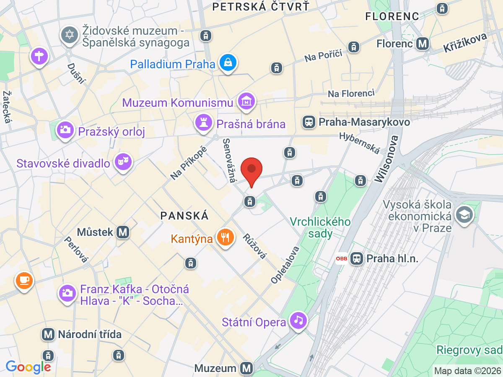
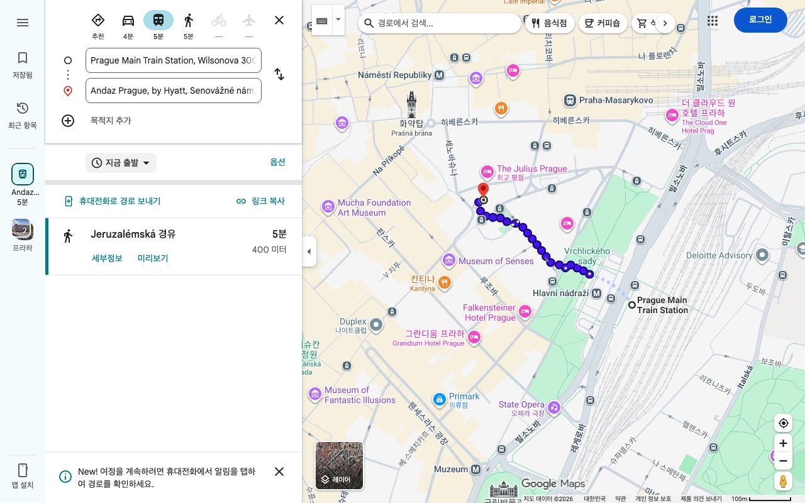
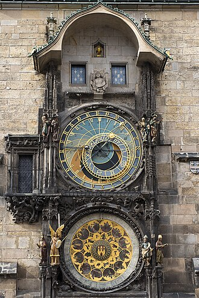
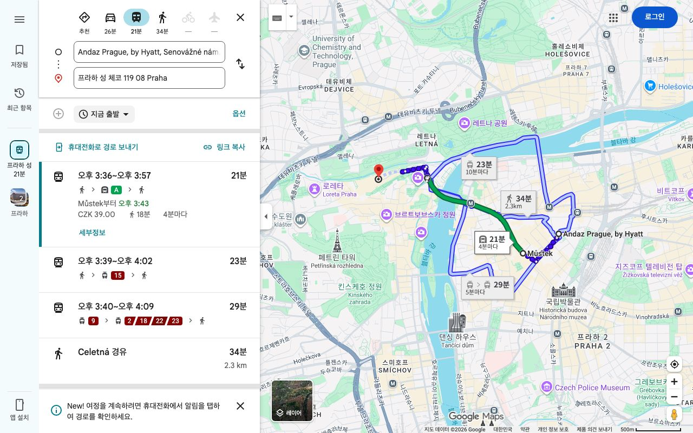
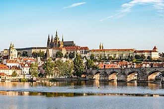
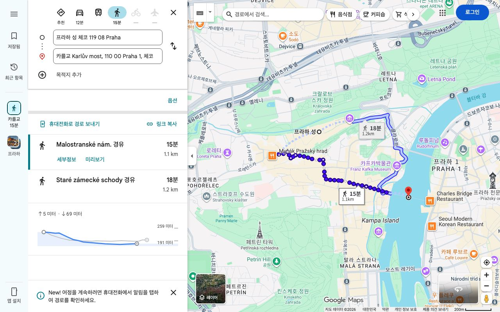
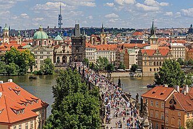
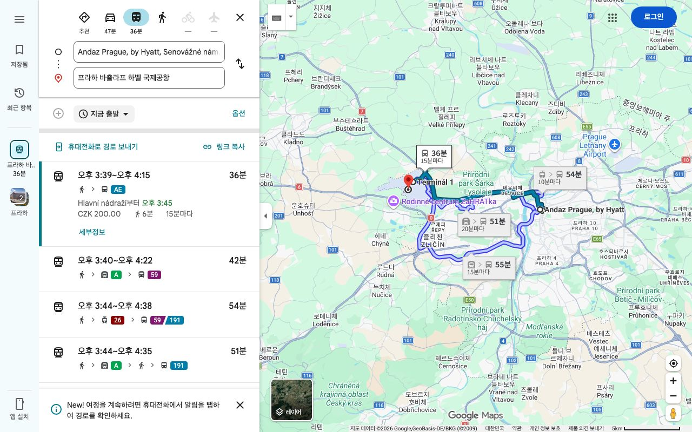

# 🇨🇿 4. 프라하 (9/11 ~ 9/14, 3박)

<table>
  <tr>
    <td width="50%" valign="top">
      <h3>🏨 안다즈 프라하</h3>
      
<b>Andaz Prague</b>

      
✨ <b>특징:</b> '진흙의 탑(Mud Tower)' 근처 신시가지 중심에 위치한 최고급 호텔로, 구시가지와 기차역 모두 접근성이 뛰어남. 로맨틱한 중세 도시의 정점을 느낄 수 있음.

    </td>
    <td width="50%" valign="top">
      
    </td>
  </tr>
</table>

## 🗓️ 일정 계획

### 📍 9/11 (금) 프라하 도착
* **09:52 ~ 11:04**: 잘츠부르크에서 린츠(Linz)로 이동. (Westbahn 911 열차, 15호차, 좌석번호 513A & 513B)
* **11:54 ~ 15:39**: 린츠에서 기차 환승 후 프라하 중앙역(Praha hl.n.) 도착. (OBB EC 334 열차, 플랫폼 1A-B, 368호차, 좌석번호 95 & 96)
* **15:39 ~ 17:00**: 프라하 도착 및 호텔 체크인. 안다즈 프라하는 구시가지 근처에 위치합니다.
  * 🚋 **이동 방법 (프라하 중앙역 ➡️ 안다즈 프라하)**:
    * 기차역(Hlavní nádraží) 밖 트램 정류장에서 **9번, 5번, 26번 트램** 중 하나를 탑승 ➡️ 한 정거장 이동 후 'Jindřišská' 하차하여 도보 3분. (택시 이용 시 5분 내 도착).
    * 
* **17:00 ~ 21:00**: 구시가 광장으로 도보 이동. 매시 정각에 울리는 **천문시계탑** 쇼를 관람하고, 틴 성당과 화약탑 주변의 야경을 즐기며 체코 흑맥주(코젤 등)와 꼴레뇨로 저녁 식사.
  * 🚶‍♂️ **이동 방법 (호텔 ➡️ 구시가 광장)**:
    * 호텔에서 도보로 화약탑(Powder Tower)을 지나 첼레트나(Celetná) 거리를 따라 직진하면 10분 내로 구시가 광장에 도착합니다.
  * 
* 💡 **Tip**: 천문시계탑 정각 쇼는 약 30초 정도로 짧지만 주변 분위기가 압도적입니다. 광장 주변에는 소매치기가 꽤 있으니 구경할 때 가방을 앞으로 매세요.

### 📍 9/12 (토) 프라하 성과 카를교
* **07:00 ~ 09:00**: 기상 및 조식.
* **09:00 ~ 13:00**: 트램을 타고 언덕 위의 **프라하 성**으로 이동. (아침 일찍 가야 보안 검색대 줄이 짧습니다.) 성 비투스 대성당의 스테인드글라스, 구왕궁, 아기자기한 황금소로 등 관람.
  * 🚋 **이동 방법 (호텔 ➡️ 프라하 성)**:
    * 호텔 근처 'Náměstí Republiky' 정류장에서 **15번 트램** 탑승 ➡️ 'Malostranská' 하차 후 **22번 트램**으로 환승 ➡️ 'Pražský hrad(프라하 성)' 정류장에서 하차 (약 25분 소요). 언덕을 힘들이지 않고 올라가는 가장 추천하는 트램 경로입니다.
    * 
  * 
* **13:00 ~ 15:00**: 말라스트라나 지구(성채 아래)의 로맨틱한 식당에서 점심 식사.
* **15:00 ~ 18:00**: 아름다운 상점들이 모인 네루도바 거리를 따라 걸어 내려옴. 존 레논 벽을 구경한 뒤, 해 질 녘에 맞추어 **카를교** 도보 횡단. 거리의 악사들과 블타바 강, 붉은 노을의 조화 감상.
  * 🚶‍♂️ **이동 방법 (프라하 성 ➡️ 카를교)**:
    * 프라하 성 관람 후, 말라스트라나의 옛 골목길(Nerudova 거리)을 따라 천천히 걸어 내려오면 약 15~20분 만에 카를교 입구에 닿습니다.
    * 
  * 
* **18:00 ~ 21:00**: 카를교를 건너 구시가로 돌아와 저녁 식사. 길거리 간식인 '뜨르들로(굴뚝빵)' 필수 맛보기.
* 💡 **Tip**: 프라하 성의 성 비투스 대성당 내부에 있는 알폰스 무하의 스테인드글라스는 햇빛이 들어오는 오전에 보아야 가장 아름답습니다.

### 📍 9/13 (일) 구시가 깊이 보기 및 재즈 바
* **07:00 ~ 09:00**: 기상 및 조식.
* **09:00 ~ 13:00**: 구시가지 미로 같은 골목길 탐방. 하벨 시장(Havel's Market)에 들러 체코 전통 기념품(목각인형, 마그넷)과 과일 구경.
* **13:00 ~ 15:00**: 점심 식사. 체코 양조장 식당 '우 플레쿠' 등에서 현지 분위기 물씬 나는 맥주 타임.
* **15:00 ~ 18:00**: 블타바 강변을 따라 산책하거나, 댄싱 하우스 배경으로 사진 촬영. 체코 화가 알폰스 무하 박물관 관람 추천.
* **18:00 ~ 22:00**: 저녁 식사 후 프라하 특유의 문화인 언더그라운드 **재즈 바** 방문 (예: Reduta Jazz Club, AghaRTA). 라이브 음악과 함께 프라하의 낭만적인 밤 마무리.
* 💡 **Tip**: 유명 재즈 클럽은 인기가 많아 며칠 전 미리 예매하거나 오픈 시간에 맞춰 가야 좋은 자리를 잡을 수 있습니다.

### 📍 9/14 (월) 마지막 산책 및 출국
* **07:00 ~ 09:00**: 기상 및 조식.
* **09:00 ~ 12:00**: 호텔 체크아웃 후 짐 보관. 세상에서 가장 아름다운 도서관 중 하나인 스트라호프 수도원을 방문하거나, 페트린 타워에 올라 프라하의 붉은 지붕들을 마지막으로 눈에 담기.
* **12:00 ~ 14:00**: 시내에서 마지막 오찬.
* **14:00 ~ 16:00**: 호텔로 돌아와 짐을 찾고 프라하 바츨라프 하벨 국제공항(PRG)으로 이동.
  * 🚕 **이동 방법 (호텔 ➡️ 프라하 공항)**:
    * 캐리어가 있으므로 볼트(Bolt)나 우버(Uber)를 호출하여 이동하는 것을 추천합니다. (약 30~40분 소요, 500~600 CZK 내외).
    * 대중교통 이용 시 프라하 중앙역 앞으로 이동해 공항 직행 버스(AE: Airport Express)를 타면 편리하게 공항 터미널 앞까지 도착합니다.
    * 
* **16:00 ~ 19:00**: 공항 수속 및 면세점 구경. (19:05 귀국 비행기 탑승).
* 💡 **Tip**: 체코는 유로가 아닌 코루나(CZK)를 사용하므로, 남은 코루나가 있다면 공항에서 면세품이나 초콜릿 등을 사서 털어버리는 것이 좋습니다.

## 🍽️ 추천 음식 & 식당

* **꼴레뇨 (Koleno) & 스비치코바 (Svíčková)**: 체코식 족발 요리인 꼴레뇨와 부드러운 소고기에 크림 소스와 크랜베리를 곁들인 스비치코바는 필수.
* **필스너 우르켈 (Pilsner Urquell)**: 체코의 명물 생맥주 (물보다 저렴하고 맛있음)
* **우 메드비드쿠 (U Medvídků) 또는 우 플레쿠 (U Fleků)**: 수백 년의 역사를 가진 양조장 식당으로, 진정한 체코 전통 음식과 현장에서 양조한 신선한 흑맥주를 맛볼 수 있음.
* **굴뚝빵 (Trdelník)**: 시내 길거리 어디서나 쉽게 만날 수 있는 시나몬 향 가득한 프라하 대표 길거리 디저트.

---
[⬅️ 메인으로 돌아가기](./README.md)
