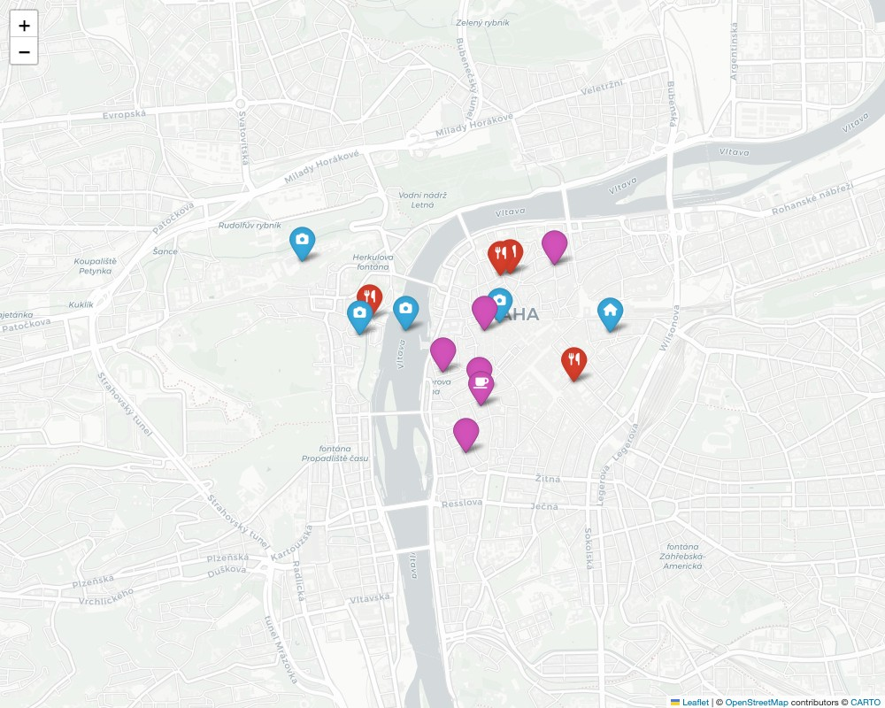

# 🇨🇿 프라하 - 미식, 주류 & 쇼핑 가이드

물보다 맥주가 싸고 맛있는 나라, 체코. 프라하는 완벽하게 보존된 중세의 낭만적인 풍경 속에서 진한 흑맥주와 육즙 가득한 돼지고기 요리를 저렴하게 즐길 수 있는 미식 천국입니다.

---

## 🗺️ 한눈에 보는 미식 & 관광 지도

여행 동선과 맞물려 방문하기 좋은 핵심 관광지(파란색)와 추천 식당(빨간색), 그리고 로컬 펍/주류 특화 공간(보라색)의 위치입니다.

---

## 🍽️ 체코 필수 전통 음식

* **꼴레뇨 (Koleno)**: 체코식 돼지 무릎(족발) 오븐 구이. 겉껍질은 칼이 안 들어갈 정도로 바삭하고 쫀득하며, 속살은 수육처럼 촉촉하고 부드럽습니다. 머스타드, 호스래디시(서양 고추냉이)와 함께 흑맥주를 곁들이면 천국이 따로 없습니다.
* **타타라크 (Tatarák)**: 체코식 소고기 육회. 다진 생소고기에 마늘, 양파, 향신료 등을 취향껏 섞은 뒤, 생마늘을 쓱쓱 문질러 향을 입힌 튀긴 빵(Topinka) 위에 올려 먹는 기가 막힌 술안주입니다.
* **스비치코바 (Svíčková)**: 부드러운 소고기 등심에 진하고 달콤한 크림 채소 소스를 얹고, 체코식 찐빵 같은 크네들리키(Knedlíky), 크랜베리 잼, 휘핑크림을 곁들여 먹는 고급스러운 체코 전통 요리.
* **뜨르들로 (Trdelník)**: 일명 '굴뚝빵'. 시나몬 설탕을 듬뿍 발라 숯불에 구워낸 길거리 빵으로, 최근에는 속을 초콜릿 누텔라나 아이스크림으로 가득 채워 먹는 것이 트렌드입니다.

---

## 🥩 추천 레스토랑 & 디저트 카페

모든 식당 이름의 링크를 클릭하시면 구글 맵(Google Maps)으로 이동합니다.

### 1. 현지인과 관광객 모두가 사랑하는 고기 맛집
* **[포크스 (Pork's)](https://www.google.com/maps/search/?api=1&query=Pork's+Prague)** (프라하 성/카를교 인근)
  * **특징**: "프라하 최고의 꼴레뇨"를 자부하는 곳. 압도적인 비주얼과 완벽한 겉바속촉 식감으로 한국인 관광객 사이에서도 극찬이 자자한 맛집입니다. 맥주 관리 상태도 훌륭합니다.
* **[칸티나 (Kantýna)](https://www.google.com/maps/search/?api=1&query=Kantýna+Prague)** (신시가지/화약탑 근처)
  * **특징**: 옛 은행 건물을 개조한 트렌디한 푸줏간(정육점) 콘셉트의 레스토랑. 입장 시 뼈 모양의 주문표를 받아 원하는 부위의 고기와 맥주를 주문하는 방식입니다.
  * **추천 메뉴**: 신선한 카르파초, 뼈가 붙어있는 티본 스테이크, 그리고 최고의 타타라크(육회).
* **[브 콜코브네 (V Kolkovně)](https://www.google.com/maps/search/?api=1&query=V+Kolkovně+Prague)** (구시가 광장 근처)
  * **특징**: 필스너 우르켈 본사에서 직접 품질을 보증하는 오리지널 펍. 분위기가 깔끔하고 세련되어 부모님을 모시고 가기에도 좋으며, 꼴레뇨와 오리 구이가 맛있습니다.
* **[크르츠마 (Krčma)](https://www.google.com/maps/search/?api=1&query=Krčma+Prague)** (구시가 광장 인근 골목)
  * **특징**: 촛불로만 불을 밝히는 동굴 같은 지하 인테리어로, 중세 시대 주막에 들어온 듯한 몰입감을 주는 식당. 어두운 분위기에서 꼴레뇨와 흑맥주를 뜯는 낭만이 있습니다.

### 2. 역사적인 디저트 카페
* **[카페 루브르 (Café Louvre)](https://www.google.com/maps/search/?api=1&query=Café+Louvre+Prague)**
  * **특징**: 1902년에 개업한 유서 깊은 카페로 프란츠 카프카와 알베르트 아인슈타인의 단골집이었습니다. 고풍스러운 분홍색과 크림색 인테리어 속에서 아침 식사나 우아한 디저트를 즐기기 완벽합니다.

---

## 🍺 체코 맥주와 펍, 주류 특화 경험 (Bars & Drinks)

체코는 1인당 맥주 소비량 세계 1위 국가입니다. 맥주 거품을 따르는 방식조차 3가지(할링카, 슈니츠, 밀리코)로 세분화할 정도로 맥주에 진심입니다.

* **현지인들의 핫플 펍: [로칼 (Lokál Dlouhááá)](https://www.google.com/maps/search/?api=1&query=Lokál+Dlouhááá+Prague)**
  * **특징**: 프라하에서 가장 트렌디하고 시끌벅적한 로컬 펍. 파이프 관을 통해 직배송되는 가장 신선하고 차가운 필스너 우르켈 생맥주를 맛볼 수 있습니다. 짭짤한 튀긴 치즈(Smažený sýr)와 스비치코바 안주가 일품.
* **500년 역사의 양조장: [우 플레쿠 (U Fleků)](https://www.google.com/maps/search/?api=1&query=U+Fleků+Prague)**
  * **특징**: 1499년부터 단 한 번도 쉬지 않고 맥주를 양조해 온 전설적인 펍. 이곳에서만 맛볼 수 있는 진하고 달콤쌉싸름한 13도짜리 **독자적인 다크 라거(흑맥주)** 단 한 가지만 판매합니다. 아코디언 연주자가 돌아다니며 연주하는 흥겨운 분위기가 최고입니다. (단, 직원이 권하는 전통 식후주 베체로브카 샷은 유료이니 원치 않으면 거절하세요.)
* **크래프트 맥주: [프라하 비어 뮤지엄 (Prague Beer Museum)](https://www.google.com/maps/search/?api=1&query=Prague+Beer+Museum)**
  * **특징**: 이름은 박물관이지만 실제로는 30가지가 넘는 체코 전역의 로컬 마이크로 브루어리 수제 맥주 탭을 갖춘 펍입니다. 샘플러를 주문해 다양한 맥주를 비교 테이스팅하기 좋습니다.
* **전통과 이색 맥주: [우 메드비드쿠 (U Medvídků)](https://www.google.com/maps/search/?api=1&query=U+Medvídků+Prague)**
  * **특징**: 1466년부터 시작된 옛 양조장 겸 호텔. 세계에서 가장 독한 맥주 중 하나로 꼽히는 알코올 도수 12.6%의 'X33' 맥주를 맛볼 수 있습니다.
* **칵테일과 압생트: [헤밍웨이 바 (Hemingway Bar)](https://www.google.com/maps/search/?api=1&query=Hemingway+Bar+Prague)**
  * **특징**: 프라하 최고의 칵테일 바. 예술가들이 사랑했던 환각의 술 '압생트(Absinthe)'를 전통 방식(불을 붙여 각설탕을 녹이는 방식)으로 서빙해 주는 독특한 경험을 할 수 있습니다. (예약 필수)

---

## 🛍️ 필수 쇼핑 리스트

1. **마누팍투라 (Manufaktura)**
   * **설명**: 체코를 대표하는 자연주의 화장품 브랜드. 체코 전통 맥주 원료로 만든 **맥주 샴푸**가 탈모 방지와 머릿결에 좋기로 유명하여 한국인들의 쇼핑 1순위입니다. 살구 립밤과 와인 바디워시도 선물용으로 강력 추천합니다. (구시가지 곳곳에 매장이 있음)
2. **보타니쿠스 (Botanicus)**
   * **설명**: 천연 유기농 화장품 브랜드. 특히 일명 '전지현 장미 오일'로 불리는 로즈 에센셜 페이셜 오일은 보습력이 뛰어나 어머니들 선물로 완벽합니다.
3. **콜로나다 (Kolonáda)**
   * **설명**: 체코 카를로비 바리 지역에서 유래한 크고 둥글고 얇은 전통 와플 과자. 커피나 차와 곁들이기 좋아 마트(Albert, Billa 등)에서 저렴하게 쓸어 담기 좋습니다.
4. **베체로브카 (Becherovka)**
   * **설명**: 카를로비 바리 온천수와 수십 가지 허브를 배합해 만든 체코의 전통 식후주(소화제 술). 특유의 계피와 허브 향이 매력적이며, 토닉워터에 타서 '베톤(Beton)' 칵테일로 마시면 아주 맛있습니다.
5. **보헤미아 크리스털 (Bohemia Crystal)**
   * **설명**: 체코는 유리가 세공 기술이 세계 최고 수준입니다. 와인잔이나 위스키 글라스, 예쁜 크리스털 소품을 구경하고 구매하기 좋습니다.

---
[⬅️ 프라하 일정으로 돌아가기](./Prague.md)
 
[⬅️ 메인으로 돌아가기](./README.md)
