# 🇦🇹 3. 잘츠부르크 (9/9 ~ 9/11, 2박)

<table>
  <tr>
    <td width="50%" valign="top">
      <h3>🏨 빌라 베르데</h3>
      
<b>Villa Verde</b>

      
✨ <b>특징:</b> 모차르트와 사운드 오브 뮤직의 도시. 구시가지에서 약간 떨어진 조용하고 아늑한 정원이 있는 감성 B&B로, 휴식과 힐링에 제격.

    </td>
    <td width="50%" valign="top">
      <a href="https://www.google.com/maps/search/?api=1&query=Villa+Verde+Salzburg" target="_blank">
        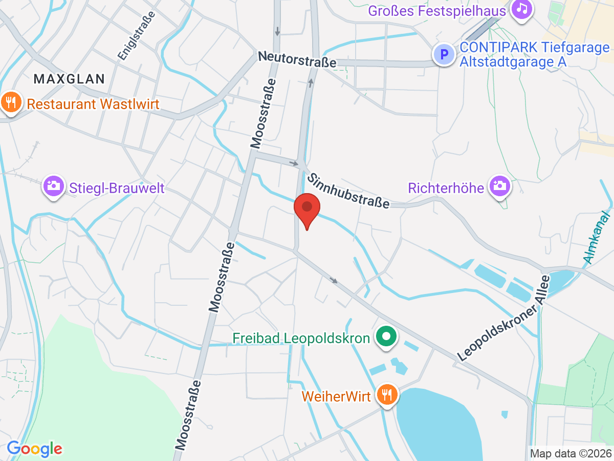
      </a>
    </td>
  </tr>
</table>

## 🗓️ 일정 계획

### 📍 9/9 (수) 잘츠부르크 도착 및 야경
* **07:00 ~ 11:28**: 비엔나에서 조식 후 체크아웃 및 중앙역(Wien Hbf)으로 이동.
  * 🚇 **이동 방법 (파크 하얏트 비엔나 ➡️ 비엔나 중앙역)**:
    * 호텔에서 도보 5분 거리인 'Stephansplatz' 역에서 **U1(빨간색)** 탑승 ➡️ 'Südtiroler Platz-Hauptbahnhof(중앙역)' 하차 (약 15분 소요).
    * <a href="https://www.google.com/maps/dir/?api=1&origin=Park+Hyatt+Vienna&destination=Wien+Hauptbahnhof&travelmode=transit" target="_blank">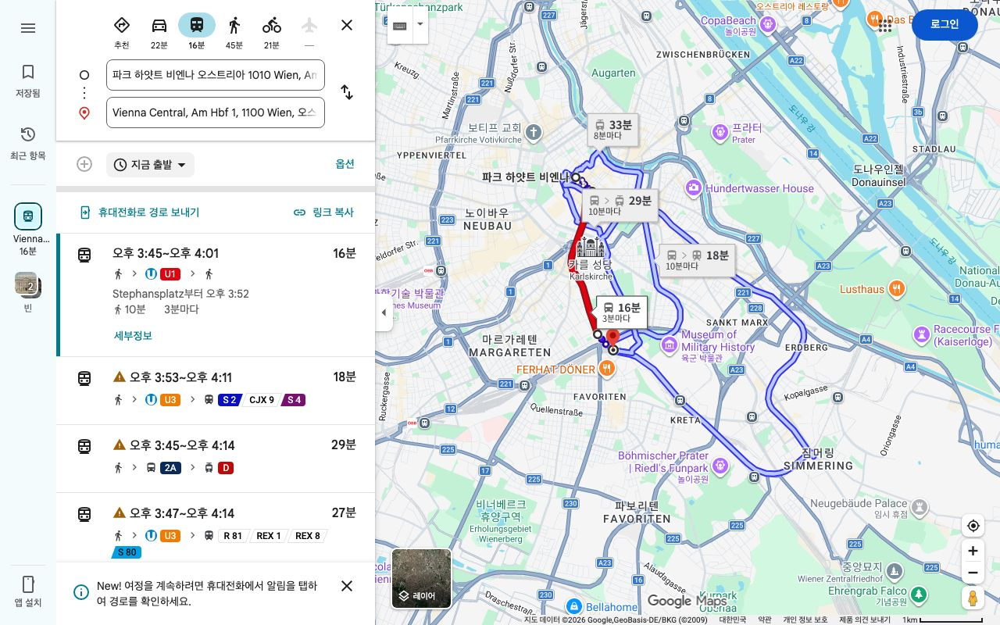</a>
      

<b>다른 맵</b>
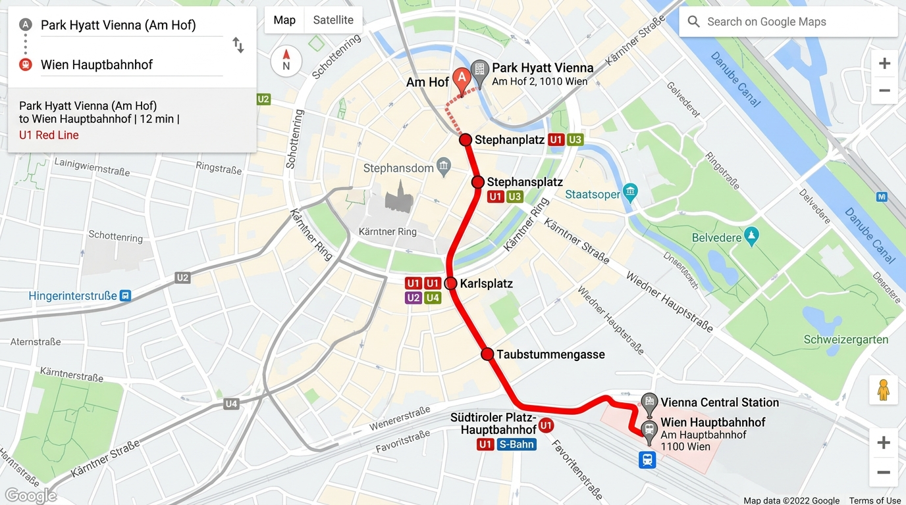

* **11:28 ~ 13:53**: 기차 탑승 및 잘츠부르크로 이동. (OBB RJX 19976 열차, 23호차, 좌석번호 41 & 43)
* **13:53 ~ 15:00**: 잘츠부르크 도착 및 호텔(빌라 베르데) 체크인.
  * 🚌 **이동 방법 (잘츠부르크 중앙역 ➡️ 빌라 베르데 호텔)**:
    * 중앙역 앞 버스 터미널 정류장에서 **1번 버스** 탑승 ➡️ 약 15분 이동 후 'Moosstraße' 근처 정류장 하차 (도보 2분 거리).
    * <a href="https://www.google.com/maps/dir/?api=1&origin=Salzburg+Hauptbahnhof&destination=Hotel+Villa+Verde,+Salzburg&travelmode=transit" target="_blank">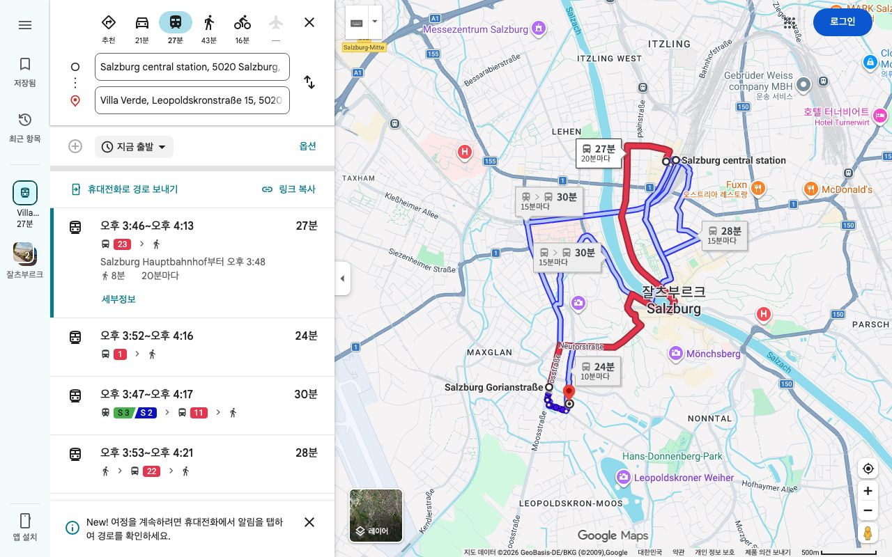</a>
      

<b>다른 맵</b>
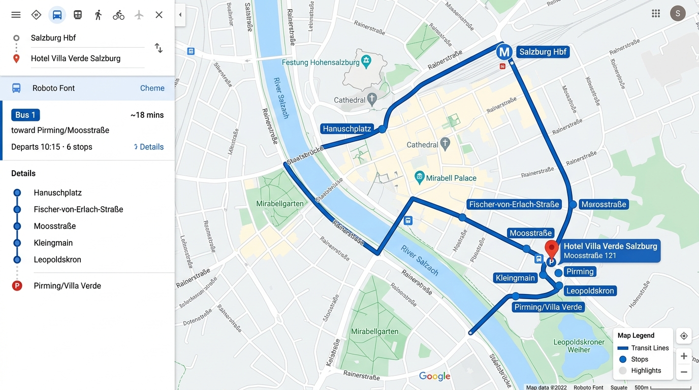

* **15:00 ~ 18:00**: 버스를 타고 구시가지(알트슈타트)로 이동. 예쁜 철제 간판이 늘어선 **게트라이데 거리**를 산책하고 **모차르트 생가** 관람.
  * 🚌 **이동 방법 (호텔 ➡️ 구시가지)**:
    * 숙소 근처 정류장에서 **1번 버스** 탑승 ➡️ 시내 중심부 'Hanuschplatz(하누쉬플라츠)' 하차 후 도보 3분 (약 10분 소요).
    * 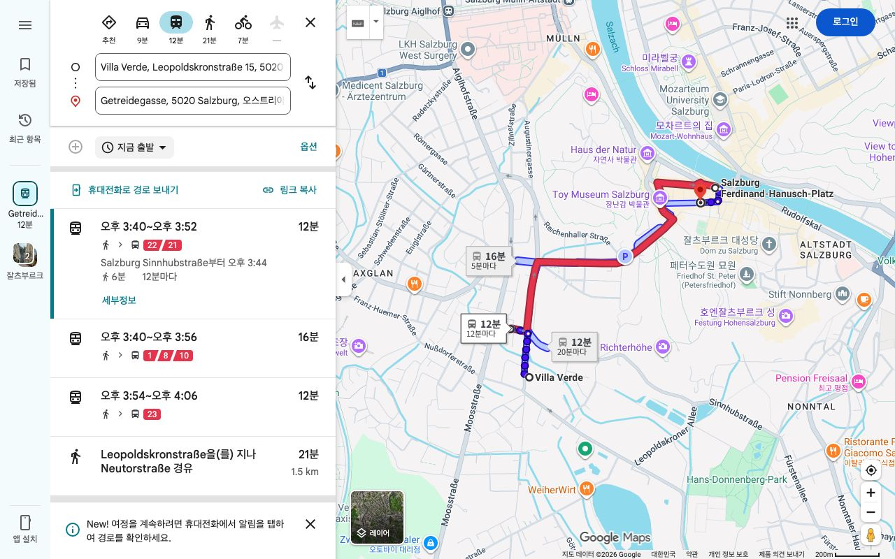
  * 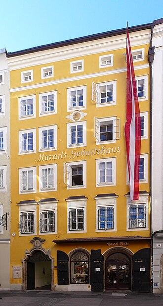
* **18:00 ~ 21:00**: 잘츠자흐 강변을 따라 걸으며 일몰 감상. 저녁에는 '아우구스티너 수도원 맥주홀'에 들러 오크통에서 뽑아내는 신선한 맥주와 학센 즐기기. 멀리 불 켜진 호엔잘츠부르크 성의 완벽한 야경 감상. 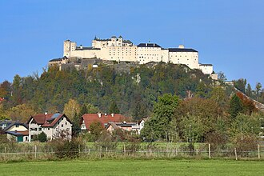
* 💡 **Tip**: 잘츠부르크 시내 대중교통과 주요 관광지 입장이 모두 무료인 '잘츠부르크 카드(24시간권)'를 중앙역이나 인포메이션에서 구매하면 매우 경제적입니다.

### 📍 9/10 (목) 미라벨 정원과 호엔잘츠부르크 성
* **07:00 ~ 09:00**: 기상 및 조식.
* **09:00 ~ 12:00**: 영화 '사운드 오브 뮤직'의 도레미송 배경인 **미라벨 정원** 산책. 아침 이른 시간이 꽃과 조각상 사진을 찍기에 가장 좋습니다. 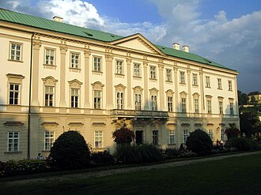
* **12:00 ~ 14:00**: 구시가지로 넘어와 점심 식사 후 명물 디저트인 '잘츠부르거 노케를(수플레)' 맛보기.
* **14:00 ~ 17:00**: 케이블카(푸니쿨라)를 타고 **호엔잘츠부르크 성**에 등반. 성 내부 무기고 등을 관람하고, 잘츠부르크 시내와 알프스 만년설이 어우러진 최고의 파노라마 절경 감상.
  * 🚶‍♂️🚡 **이동 방법 (구시가지 ➡️ 호엔잘츠부르크 성)**:
    * 카피텔 광장(Kapitelplatz)에서 페스퉁스가세(Festungsgasse) 길을 따라 도보 이동 ➡️ **푸니쿨라(Festungsbahn)** 탑승장 도착 ➡️ 1분 만에 성벽 위로 수직 상승.
    * 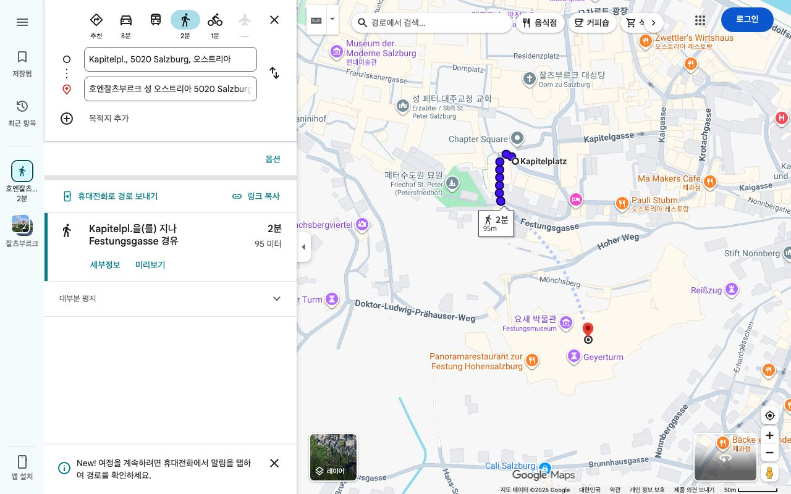
* **17:00 ~ 20:00**: 잘츠부르크 대성당과 레지덴츠 광장 산책 후 여유로운 저녁 식사.
* 💡 **Tip**: 호엔잘츠부르크 성의 야외 카페테리아에서 커피 한 잔을 마시며 내려다보는 시내 전경이 예술입니다.

### 📍 9/11 (금) 프라하로 이동 전 오전
* **07:00 ~ 09:50**: 기상, 여유로운 조식 후 짐 정리 및 잘츠부르크 중앙역으로 이동.
  * 🚌 **이동 방법 (호텔 ➡️ 잘츠부르크 중앙역)**:
    * 올 때와 동일하게 숙소 근처 길 건너 정류장에서 **1번 버스** 탑승 ➡️ 종점인 'Salzburg Hbf(중앙역)' 하차 (약 15분 소요).
    * 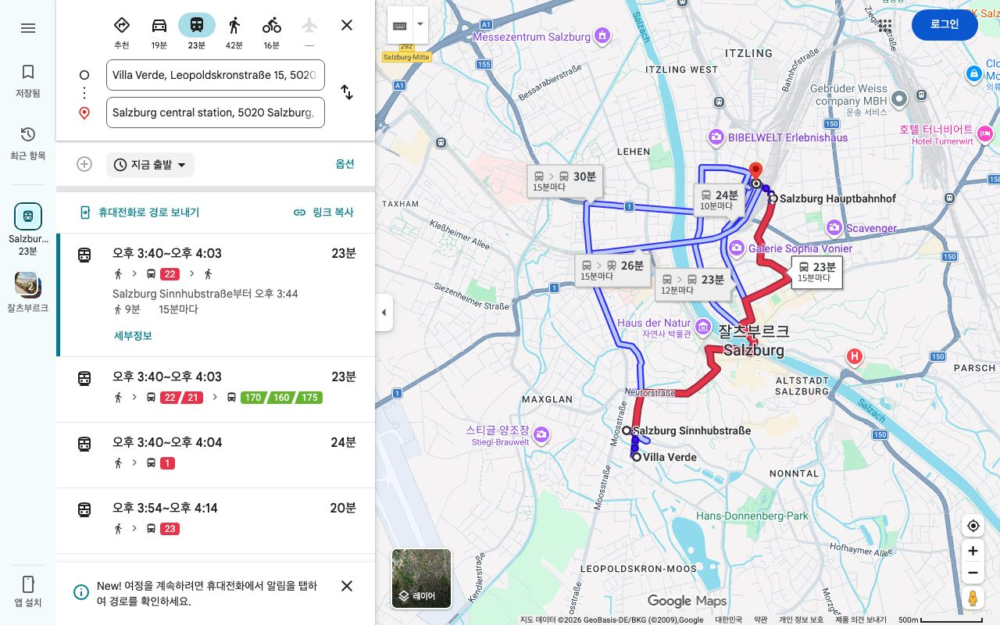
* **09:52 ~ 11:04**: 잘츠부르크 출발, 린츠(Linz) 도착. (Westbahn 911 열차, 15호차, 좌석번호 513A & 513B)
* **11:04 ~ 11:54**: 린츠 역에서 프라하행 기차 환승 대기.

## 🍽️ 추천 음식 & 식당

* **잘츠부르거 노케를 (Salzburger Nockerl)**: 잘츠부르크의 눈 덮인 세 봉우리를 형상화한 거대하고 부드러운 수플레 디저트.
* **보스나 (Bosna)**: 구운 빵 사이에 소시지, 양파, 카레 가루를 넣은 잘츠부르크식 핫도그.
* **추천 식당 & 카페**:
  * **[아우구스티너 브로이 (Augustiner Bräustübl)](https://www.google.com/maps/search/?api=1&query=Augustiner+Bräustübl+Salzburg)**: 수도원에서 직접 양조하는 수제 맥주홀. 오크통 맥주와 각종 안주(학센, 프레첼 등)를 푸드코트처럼 사서 야외 가든에서 즐기는 필수 코스.
  * **[슈테른브로이 (Sternbräu)](https://www.google.com/maps/search/?api=1&query=Sternbräu+Salzburg)**: 정통 오스트리아 요리부터 맥주까지 아우르는 크고 쾌적한 비어 가든 겸 레스토랑.
  * **[발칸 그릴 발터 (Balkan Grill Walter)](https://www.google.com/maps/search/?api=1&query=Balkan+Grill+Walter+Salzburg)**: 게트라이데 거리에 숨어있는 70년 전통의 원조 보스나(소시지 핫도그) 맛집.
  * **[카페 토마셀리 (Café Tomaselli)](https://www.google.com/maps/search/?api=1&query=Café+Tomaselli+Salzburg)**: 오스트리아에서 가장 오래된 카페이자 모차르트의 단골 카페.

## 🛍️ 필수 쇼핑 리스트

* **오리지널 모차르트 쿠겔 (Original Salzburger Mozartkugel)**: 퓌르스트(Fürst) 카페에서 파는 은색 바탕에 파란색 글씨 포장지의 초콜릿. (수제 원조이며 잘츠부르크에서만 살 수 있음)
* **소금 (Salz)**: '소금의 성'이라는 도시 이름답게 암염(돌소금)이 유명. 트러플 소금, 갈릭 소금 등 향신료 소금이 요리용 선물로 좋음.
* **모차르트 오리 인형**: 모차르트 복장을 한 귀여운 노란 오리 장난감. 가벼운 기념품으로 제격.

---
[⬅️ 메인으로 돌아가기](./README.md)
