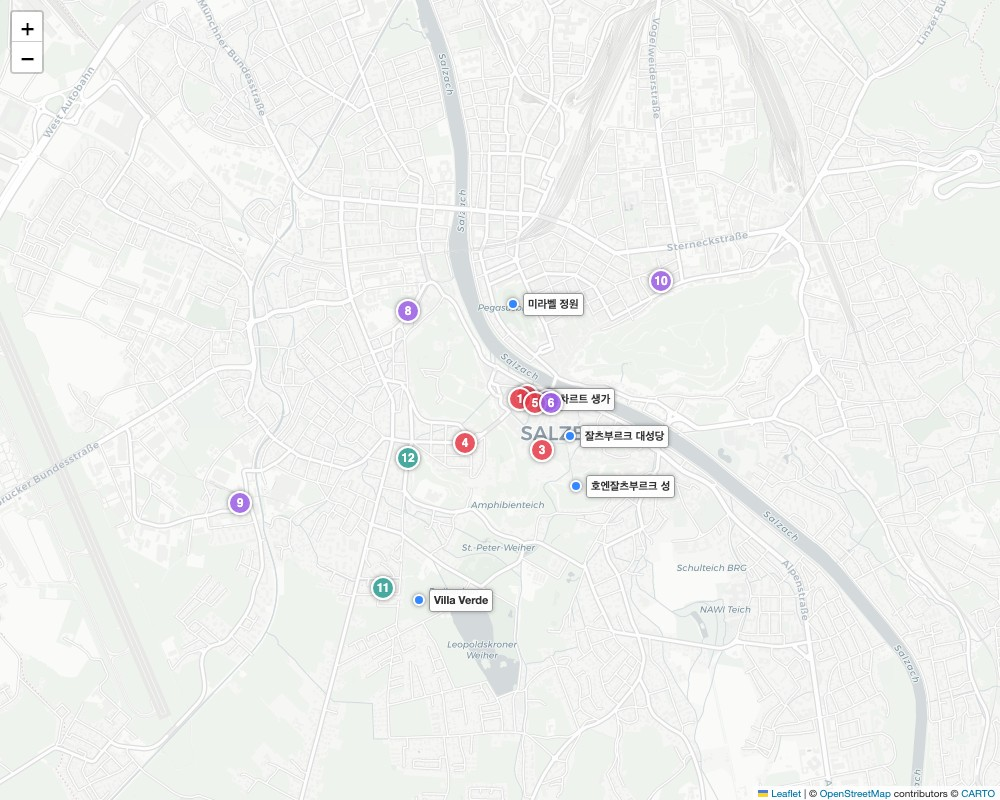

# 🇦🇹 잘츠부르크 - 미식, 주류 & 쇼핑 가이드

---

## 🗺️ 한눈에 보는 미식 & 관광 지도

관광지 및 숙소는 파란색 이름표로 표시되어 있으며, 맛집 및 길거리 간식은 붉은색 번호, 카페와 맥주 양조장은 보라색 번호로 표시되어 있습니다. 

---

## 🍽️ 잘츠부르크 필수 전통 음식
* **잘츠부르거 노케를 (Salzburger Nockerl)**: 알프스의 눈 덮인 세 개의 산봉우리를 형상화한 거대한 수플레 디저트. 오븐에서 갓 구워져 나와 구름처럼 가볍고 입에서 사르르 녹아내리는 달콤함이 특징입니다. 조리 시간이 20분 이상 소요됩니다.
* **보스나 (Bosna)**: 구운 흰 빵 사이에 소시지, 생양파, 파슬리를 넣고 카레 가루와 특제 향신료를 듬뿍 뿌린 잘츠부르크 특유의 핫도그.

---

## 🥩 추천 레스토랑 & 길거리 간식

### 1. 현지인과 관광객 모두가 사랑하는 식당
* **[[1] 슈테른브로이 (Sternbräu)](https://www.google.com/maps/search/?api=1&query=Sternbräu+Salzburg)**
  * **특징**: 1542년부터 이어져 온 유서 깊은 비어가든 레스토랑으로 모차르트도 자주 방문했다고 전해집니다. 슈니첼부터 타펠슈피츠까지 정통 오스트리아 요리를 넓고 쾌적한 홀에서 즐길 수 있습니다.
* **[[3] 장크트 페터 스티프츠쿨리나리움 (St. Peter Stiftskulinarium)](https://www.google.com/maps/search/?api=1&query=St.+Peter+Stiftskulinarium)**
  * **특징**: 기원후 803년에 문을 열어 문헌상 '유럽에서 가장 오래된 레스토랑'. 밤마다 열리는 '모차르트 디너 콘서트'를 예약하면 시대극 복장을 한 연주자들의 클래식 라이브와 함께 코스 요리를 즐기는 귀족적인 경험을 할 수 있습니다.
* **[[4] 레스토랑 M32 (Restaurant M32)](https://www.google.com/maps/search/?api=1&query=Restaurant+M32+Salzburg)**
  * **특징**: 묀히스베르크 산 위 현대미술관 건물에 위치한 뷰 맛집 레스토랑. 통유리창과 테라스 너머로 잘츠부르크 구시가지와 호엔잘츠부르크 성이 한눈에 내려다보이는 파노라마 뷰 속에서 브런치나 디너를 즐기기 좋습니다.

### 2. 구시가지 길거리 간식 (Street Food)
* **[[2] 발칸 그릴 발터 (Balkan Grill Walter)](https://www.google.com/maps/search/?api=1&query=Balkan+Grill+Walter+Salzburg)** (게트라이데 거리 골목)
  * **특징**: 1950년부터 영업 중인 '오리지널 보스나(핫도그)'의 발상지. 단 2평 남짓한 좁은 골목 틈새에 있지만 현지인들도 항상 줄을 서서 먹는 전설적인 길거리 맛집입니다.
* **[[5] 잘츠부르거 브레첼 (Universitätsplatz 노점)](https://www.google.com/maps/search/?api=1&query=Universitätsplatz+Salzburg)**
  * **특징**: 대학 광장(Universitätsplatz)이나 구시가지 길거리 곳곳에 큰 프레첼(Brezen)을 파는 노점들이 있습니다. 소금이 묻은 오리지널부터 치즈, 초콜릿, 견과류가 박힌 대형 프레첼은 훌륭한 길거리 간식입니다.

### 3. 역사적인 디저트 카페
* **[[6] 카페 토마셀리 (Café Tomaselli)](https://www.google.com/maps/search/?api=1&query=Café+Tomaselli+Salzburg)**
  * **특징**: 1700년에 문을 연 오스트리아에서 가장 오래된 카페이자 모차르트가 아몬드 밀크를 즐겨 마시던 단골 카페. 은쟁반에 디저트를 담아 돌아다니는 웨이트리스를 불러 조각 케이크를 고르는 클래식한 시스템이 남아 있습니다.
* **[[7] 카페 퓌르스트 (Café Fürst)](https://www.google.com/maps/search/?api=1&query=Café+Fürst+Salzburg)**
  * **특징**: 은색 바탕에 파란 글씨가 인쇄된 '오리지널 수제 모차르트 초콜릿(Mozartkugel)'을 유일하게 맛볼 수 있는 원조집. 피스타치오 마지팬을 누가와 다크 초콜릿으로 씌운 수제 초콜릿입니다.

---

## 🛒 호텔 주변 마트 & 쇼핑 (지도 내 초록색 번호)

* **[[11] SPAR (스파)](https://www.google.com/maps/search/?api=1&query=SPAR+Sinnhubstraße+Salzburg)**
  * **특징**: 숙소(빌라 베르데) 바로 길 건너편 도보 2분 거리에 위치한 마트. 물, 맥주, 간단한 간식거리를 사서 숙소 정원에서 휴식하며 즐기기 좋습니다.
* **[[12] BILLA (빌라)](https://www.google.com/maps/search/?api=1&query=BILLA+Neutorstraße+Salzburg)**
  * **특징**: 숙소에서 구시가지로 걸어가거나 버스를 타고 나가는 길목(Neutorstraße)에 위치한 마트로, 이동 중에 들르기 좋습니다.

---

## 🍺 수도원 맥주와 양조장 경험 (Bars & Drinks)

* **[[8] 아우구스티너 브로이 (Augustiner Bräustübl)](https://www.google.com/maps/search/?api=1&query=Augustiner+Bräustübl+Salzburg)**
  * **특징**: 1621년부터 수도사들이 직접 양조해 온 오스트리아 최대 규모의 비어홀. 나무통에서 갓 뽑아낸 차가운 맥주를 커다란 도자기 머그잔에 받아 마시며, 실내 푸드코트에서 립이나 소시지 등 원하는 안주를 자유롭게 사다 먹는 축제 같은 분위기입니다.
* **[[10] 디 바이세 (Die Weisse)](https://www.google.com/maps/search/?api=1&query=Die+Weisse+Salzburg)**
  * **특징**: 오스트리아에서 가장 오래된 밀맥주(Weissbier) 양조장. 향긋하고 부드러운 탁한 밀맥주가 환상적이며, 현지인들로 가득한 로컬 펍 분위기에서 프레첼 덤플링 등의 맛있는 음식을 곁들일 수 있습니다.
* **[[9] 슈티글 양조장 (Stiegl-Brauwelt)](https://www.google.com/maps/search/?api=1&query=Stiegl-Brauwelt+Salzburg)**
  * **특징**: 잘츠부르크 국민 맥주 '슈티글'의 본거지. 맥주 박물관 투어와 함께 다양한 종류의 슈티글 맥주 샘플러 테이스팅 코스가 훌륭합니다.

---
[⬅️ 잘츠부르크 일정으로 돌아가기](./Salzburg.md)  
[⬅️ 메인으로 돌아가기](./README.md)
