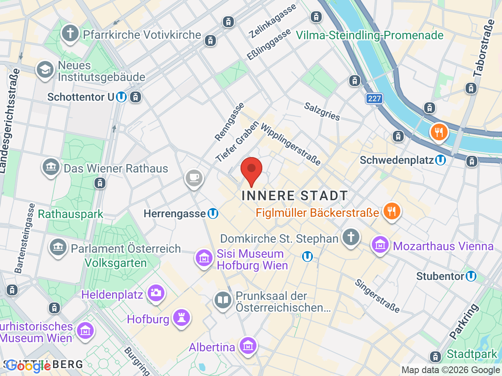
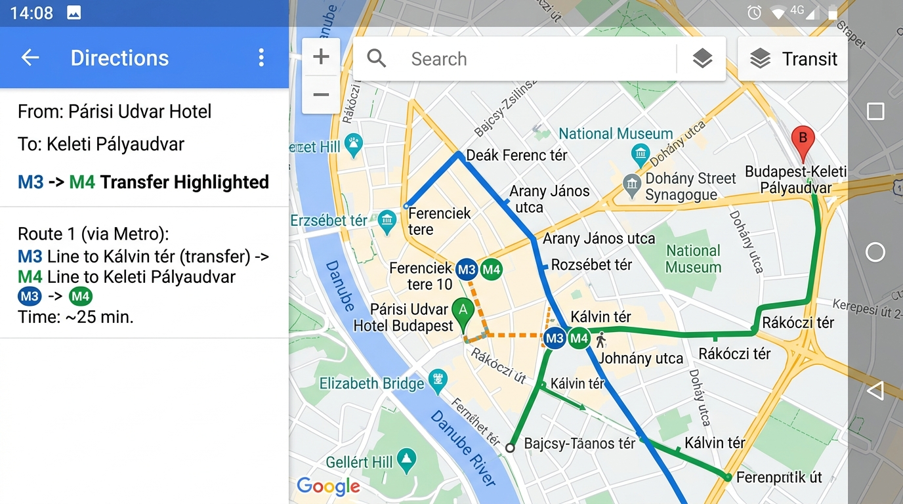
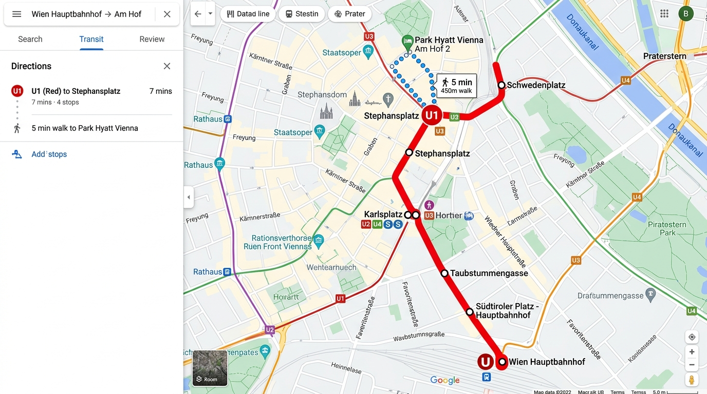
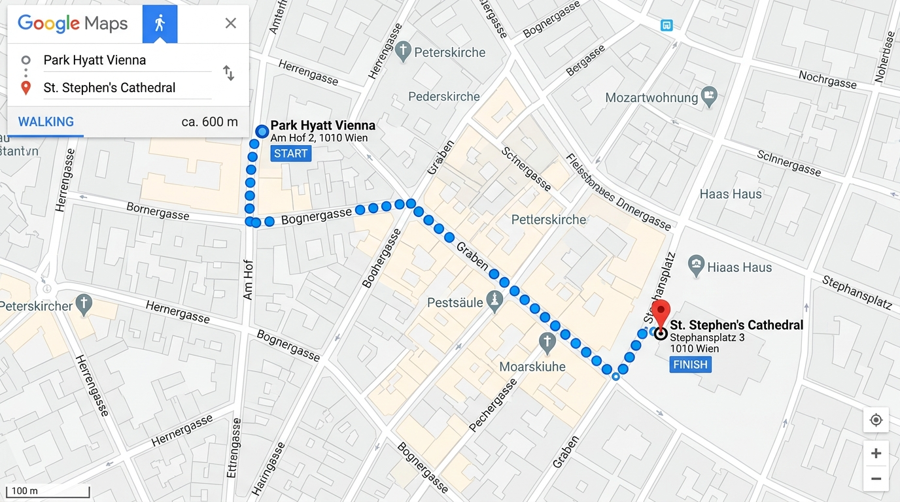
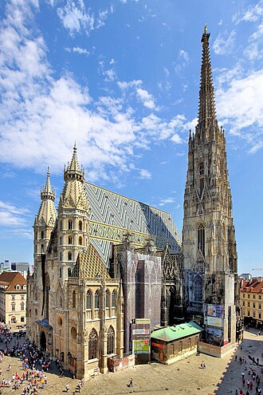
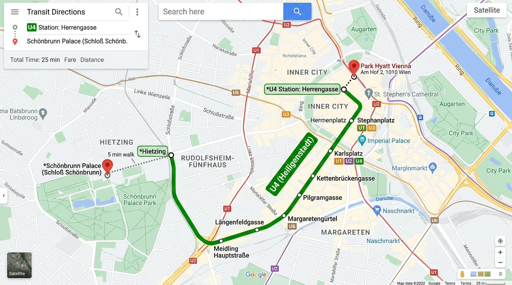
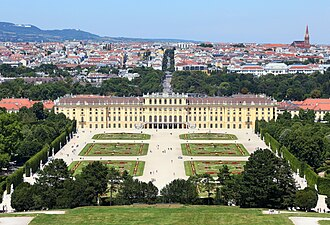
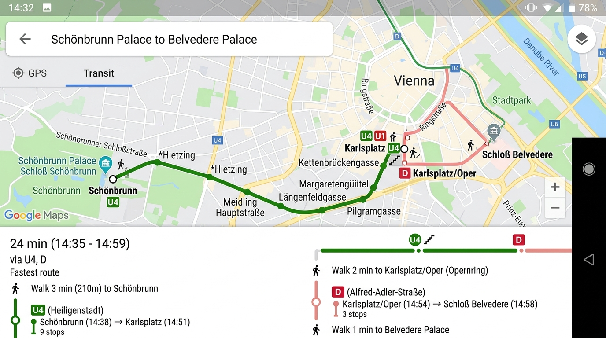
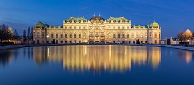
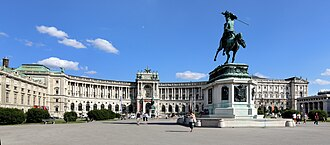

# 🇦🇹 2. 비엔나 (9/6 ~ 9/9, 3박)

<table>
  <tr>
    <td width="50%" valign="top">
      <h3>🏨 파크 하얏트 비엔나</h3>
      
<b>Park Hyatt Vienna</b>

      
✨ <b>특징:</b> 비엔나의 심장부인 '암 호프(Am Hof)' 광장에 위치해 슈테판 대성당, 명품 거리(콜마르크트) 등을 모두 도보로 이동할 수 있는 최고의 요지.

    </td>
    <td width="50%" valign="top">
      
    </td>
  </tr>
</table>

## 🗓️ 일정 계획

### 📍 9/6 (일) 비엔나 도착 및 시내 산책
* **07:00 ~ 11:30**: 부다페스트에서 조식 후 체크아웃 및 기차역(Budapest-Keleti)으로 이동.
  * 🚇 **이동 방법 (파리시 우드버르 호텔 ➡️ 켈레티 기차역)**:
    * 호텔 인근 'Ferenciek tere' 역에서 **M3(파란색)** 탑승 ➡️ 'Kálvin tér' 역에서 **M4(초록색)** 환승 ➡️ 'Keleti pályaudvar' 역 하차 (약 20분 소요).
    * 
* **11:30 ~ 14:20**: 기차 탑승 및 비엔나 중앙역(Wien Hbf)으로 이동. (OBB RJX 64 열차, 23호차, 좌석번호 104 & 106)
* **14:20 ~ 15:00**: 비엔나 시내 진입 및 호텔 체크인. 파크 하얏트 비엔나는 구시가지 중심부(Am Hof)에 위치합니다.
  * 🚇 **이동 방법 (비엔나 중앙역 ➡️ 파크 하얏트 비엔나)**:
    * 기차역 하차 후 지하철 표지판(U-Bahn)을 따라 이동 ➡️ **U1(빨간색)** 탑승 ➡️ 'Stephansplatz' 역 하차 후 도보 5분 거리 (약 15분 소요).
    * 
* **15:00 ~ 18:00**: 호텔에서 도보 5분 거리인 **슈테판 대성당** 방문. 웅장한 고딕 양식 감상 후, 비엔나의 명동이라 불리는 **게른트너 거리**와 **그라벤 거리** 산책.
  * 🚶‍♂️ **이동 방법 (호텔 ➡️ 슈테판 대성당)**:
    * 호텔 정문에서 나와 보그너가세(Bognergasse)와 그라벤(Graben) 명품 거리를 따라 직선으로 도보 5분(약 450m).
    * 
  * 
* **18:00 ~ 20:00**: 저녁으로 오리지널 '슈니첼'(예: 피그뮬러)을 맛보고 휴식.
* 💡 **Tip**: 피그뮬러 같은 유명 식당은 저녁 시간대 웨이팅이 깁니다. 여행 전 미리 온라인 예약을 해두는 것이 좋습니다.

### 📍 9/7 (월) 합스부르크 왕가의 발자취
* **07:00 ~ 09:00**: 기상 및 조식.
* **09:00 ~ 13:00**: 대중교통을 타고 **쇤브룬궁** 이동. 그랜드 투어로 화려한 궁전 내부를 관람하고, 언덕 위의 글로리에테 정원까지 산책. (총 3시간 이상 소요)
  * 🚇 **이동 방법 (호텔 ➡️ 쇤브룬 궁전)**:
    * 도보 5분 거리의 'Stephansplatz' 역 또는 'Herrengasse' 역에서 지하철 탑승 ➡️ **U4(초록색)** 노선을 타고 'Schönbrunn' 역 하차 후 도보 5분 (약 30분 소요).
    * 
  * 
* **13:00 ~ 15:00**: 시내로 돌아와 카페 센트랄(Café Central)이나 카페 자허(Café Sacher)에서 멜란지 커피와 디저트로 점심 겸 우아한 티타임.
* **15:00 ~ 18:00**: 대중교통을 이용해 **벨베데레 궁전(상궁)**으로 이동. 구스타프 클림트의 명화 '키스' 원작 감상 및 바로크 양식의 정원 산책.
  * 🚋 **이동 방법 (쇤브룬 궁전 ➡️ 벨베데레 궁전)**:
    * 'Schönbrunn' 역에서 **U4(초록색)** 탑승 ➡️ 'Karlsplatz' 역 하차 ➡️ 지상으로 올라와 **트램 D번** 탑승 ➡️ 'Schloss Belvedere' 정류장 하차 (약 25분 소요).
    * 
  * 
* **18:00 ~ 20:00**: 시내 복귀 후 **호프부르크 왕궁** 야외 야경 산책 및 저녁 식사. 
* 💡 **Tip**: 쇤브룬궁과 벨베데레 궁전 모두 오전에 관광객이 몰리므로, 티켓은 반드시 공홈에서 시간 지정 예약(Time-slot)을 해두어야 대기 없이 입장할 수 있습니다.

### 📍 9/8 (화) 예술과 음악의 날
* **07:00 ~ 09:00**: 기상 및 조식.
* **09:00 ~ 13:00**: **미술사 박물관(Kunsthistorisches Museum)** 관람. 합스부르크 왕가가 수집한 브뤼겔, 루벤스 등의 엄청난 컬렉션을 감상 (건물 자체가 예술 작품입니다). 
* **13:00 ~ 15:00**: 박물관 2층에 있는 세상에서 가장 아름다운 카페 '쿠폴라할레'에서 우아한 점심 식사.
* **15:00 ~ 18:00**: 알베르티나 미술관을 가볍게 둘러보거나, 빈 오페라 극장 주변 구시가지 골목길 쇼핑.
* **18:00 ~ 22:00**: 저녁 식사 후 **비엔나 국립 오페라 극장**이나 **무지크페어라인**에서 오페라 또는 클래식 콘서트 관람.
* 💡 **Tip**: 비엔나의 클래식 공연은 음악의 도시답게 질이 매우 높습니다. 여행 날짜에 맞는 공연 티켓을 한국에서 미리 예매해 두는 것을 강력히 추천합니다.

## 🍽️ 추천 음식 & 식당

* **슈니첼 (Schnitzel)**: 얇게 튀긴 오스트리아식 돈가스로, 레몬즙을 뿌려 감자 샐러드와 곁들여 먹음
* **피그뮬러 (Figlmüller)**: 100년 이상의 역사를 자랑하는 슈니첼 전문점, 거대한 슈니첼이 시그니처 (예약 필수)
* **카페 자허 (Café Sacher) vs 카페 센트랄 (Café Central)**: 오리지널 초콜릿 케이크인 '자허토르테'를 맛볼 수 있는 자허, 혹은 역사적인 문인들이 사랑했던 센트랄에서 멜란지(Viennese Melange) 커피 추천

---
[⬅️ 메인으로 돌아가기](./README.md)
