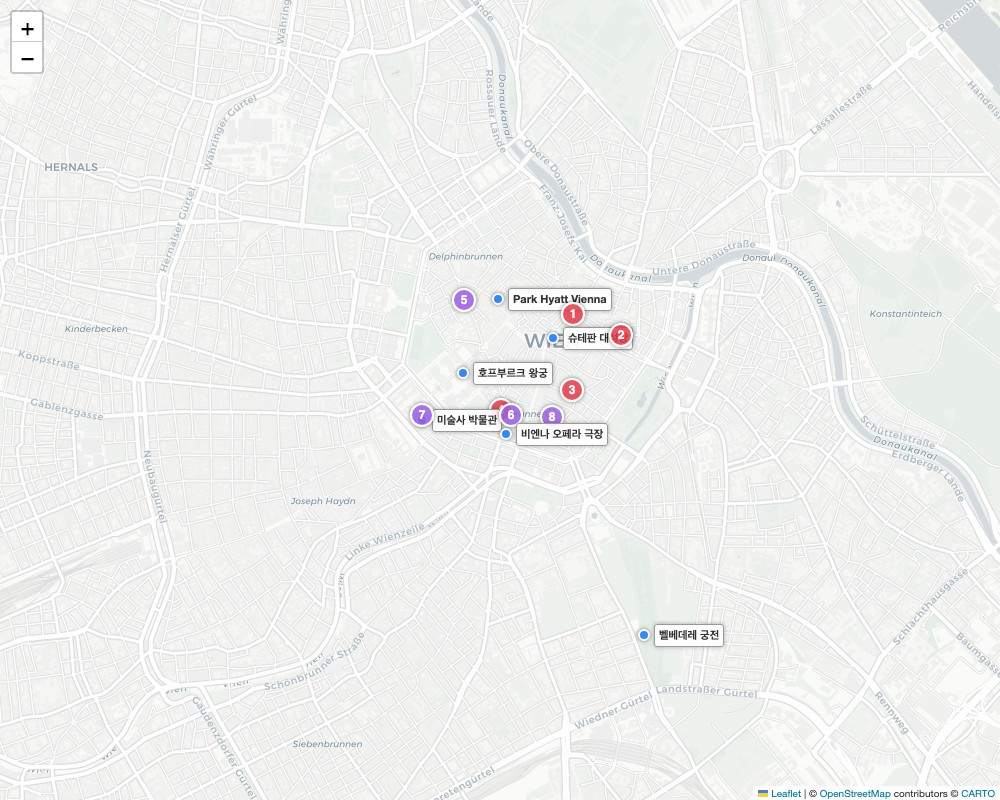

# 🇦🇹 비엔나 - 미식, 주류 & 쇼핑 가이드

---

## 🗺️ 한눈에 보는 미식 & 관광 지도

여행 동선과 맞물려 방문하기 좋은 핵심 관광지(파란색 이름표), 추천 식당(빨간색 번호), 카페/주류 특화 공간(보라색 번호)입니다. 지도 속 번호는 아래 설명과 일치합니다.

---

## 🍽️ 오스트리아 필수 전통 음식

* **슈니첼 (Wiener Schnitzel)**: 송아지 고기를 얇게 두드려 튀겨낸 오스트리아 상징 요리. 
* **타펠슈피츠 (Tafelspitz)**: 소고기를 맑은 고기 국물에 부드럽게 삶아낸 수육 요리. 
* **카이저슈마른 (Kaiserschmarrn)**: 황제가 즐겨 먹던 디저트로, 두툼한 팬케이크를 찢어 자두 콤포트에 찍어 먹습니다.
* **자허토르테 (Sachertorte)**: 살구잼이 들어간 진하고 묵직한 초콜릿 케이크.

---

## 🥩 추천 레스토랑 & 디저트 카페

### 1. 현지인과 관광객 모두가 사랑하는 맛집
* **[[1] 피그뮬러 (Figlmüller)](https://www.google.com/maps/search/?api=1&query=Figlmüller+Vienna)** 
  * **특징**: 100년 전통의 슈니첼 대명사. 접시 밖으로 삐져나올 만큼 거대한 크기. (예약 필수)
* **[[2] 플라후타 (Plachutta Wollzeile)](https://www.google.com/maps/search/?api=1&query=Plachutta+Wollzeile+Vienna)** 
  * **특징**: 오스트리아 전통 고기 요리 타펠슈피츠의 최고 명가. 정통 코스 서빙.
* **[[3] 립스 오브 비엔나 (Ribs of Vienna)](https://www.google.com/maps/search/?api=1&query=Ribs+of+Vienna)**
  * **특징**: 옛 방공호를 개조한 동굴 인테리어. 1m 길이에 달하는 폭립이 인기.
* **[[4] 비칭어 소시지 스탠드 (Bitzinger Würstelstand)](https://www.google.com/maps/search/?api=1&query=Bitzinger+Würstelstand+Albertina)** 
  * **특징**: 비엔나 최고의 소시지 스탠드. 치즈가 터져 나오는 '케제크라이너' 추천.

### 2. 비엔나 3대 카페 (Kaffeehaus)
* **[[5] 카페 센트랄 (Café Central)](https://www.google.com/maps/search/?api=1&query=Café+Central+Vienna)**
  * **특징**: 지식인들의 아지트. 화려한 아치형 천장과 피아노 라이브 연주가 돋보입니다.
* **[[6] 카페 자허 (Café Sacher)](https://www.google.com/maps/search/?api=1&query=Café+Sacher+Vienna)**
  * **특징**: '오리지널 자허토르테'가 탄생한 붉은 벨벳 장식의 고풍스러운 카페.
* **[[7] 미술사 박물관 카페 (Cafe-Restaurant im KHM)](https://www.google.com/maps/search/?api=1&query=Cafe-Restaurant+im+Kunsthistorischen+Museum)**
  * **특징**: 웅장한 대리석 기둥과 거대한 돔 아래서 식사를 즐길 수 있는 세계에서 가장 아름다운 카페 중 하나.

---

## 🍷 맥주와 와인, 주류 특화 경험 

* **[[8] 1516 브루잉 컴퍼니 (1516 Brewing Co.)](https://www.google.com/maps/search/?api=1&query=1516+Brewing+Company+Vienna)**
  * **특징**: 시끌벅적하고 힙한 크래프트 맥주 펍. 퀄리티 높은 에일과 스타우트.
* **[[9] 마이어 암 파르플라츠 (Mayer am Pfarrplatz)](https://www.google.com/maps/search/?api=1&query=Mayer+am+Pfarrplatz)**
  * **특징**: 베토벤이 머물렀던 비엔나 외곽의 로컬 와인 주막 '호이리거'. 갓 수확한 햇와인과 소박한 전통 음식.

---

## 🛍️ 필수 쇼핑 리스트
1. **마너 웨하스 (Manner Wafers)**: 핑크색 포장지가 상징인 오스트리아 국민 과자.
2. **율리어스 마인들 (Julius Meinl)**: 비엔나 프리미엄 커피 브랜드. 원두 선물 강력 추천.
3. **스와로브스키 (Swarovski)**: 오스트리아의 대표 크리스털 브랜드.

---
[⬅️ 비엔나 일정으로 돌아가기](./Vienna.md)
 
[⬅️ 메인으로 돌아가기](./README.md)
